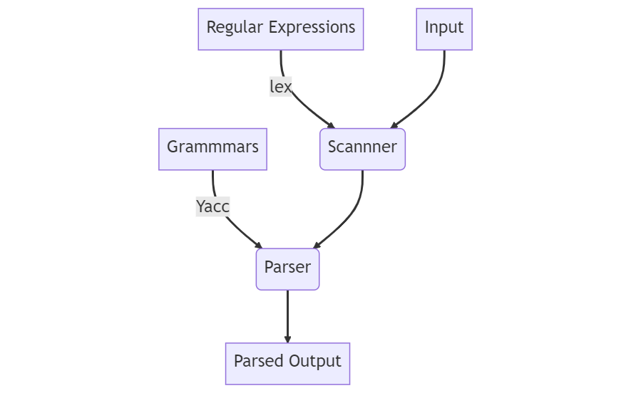

# **B-- Compiler**

- Used *Flex* (lex) & *Bison* (yacc) to generate lexical analyser (or scanner) and syntax analyser (or parser) to recognise source code of B-- programming language.
- Generates meaningful error messages to identify various errors in the syntax of provided sample code.
- Additionally, syntax analyser recovers when errors are found.


## Introduction to Lex & Yacc

Lex & Yacc are tools to generate lexical analyser and syntax analyser.


*Lex*:
1. Lex reads patterns and generates C code for scanner.
2. Scanner matches strings in the input based on the patterns.
3. Finally, the strings are converted to tokens.


*Yacc*:
1. Yacc reads grammar and generates C code for parser.
2. Parser uses grammar rules to analyze tokens from scanner and create syntax tree (parse tree).
3. Depth first walk of the syntax tree generates assembly code of the program.


## Overview of Lex & Yacc





## Introduction to B-- Language

### *Sample Source Code*

```
10 REM DISPLAY ODD NUMBERS FROM 1 TO 9
20 LET I = 1
30 PRINT I
40 LET I = I + 2
50 IF I <= 9 THEN 30
60 END
```

See [Sample Code](/correct_sample.txt) for more understanding.

Each line of the program should begin with a line number, and the lines are displayed in ascending order.

### *Program Constructs of B--*

- **Variables**: Single Upper-Case Letter (A – Z) followed by an optional single digit (0 – 9).
- **Datatypes**: Numeric – Integer (%), Single Precision (!), Double Precision (#) & Strings ($)
- **Expressions**: It can be a simple string or numeric constant or it may combine constants and variables
with operators to produce a single value.
- **DATA Statement**: Contains values that will be later used by the READ statement.
- **DEF Statement**: To define a user-defined function of one numeric variable or a pseudo-constant.
- **DIM Statement**: To specify non-default sizes of numeric arrays.
- **FOR Statement**: Used for coding pre-test loops that use an index numeric variable.
- **END Statement**: Used to specify the end of the source program.
- **STOP Statement**: Will halt execution of the program immediately.
- **IF Statement**: Used to branch conditionally to a new statement.
- **GOSUB Statement**: Used to call a subroutine.
- **RETURN Statement**: Used to exit a subroutine that was entered with GOSUB and continue execution on the
line immediately following the GOSUB
- **LET Statement**: Used to assign a value to a variable.
- **INPUT Statement**: Used to read data into one or more variables from the keyboard.
- **PRINT Statement**: Used to send output to the terminal.
- **REM Statement**: To add a comment to the source code of the program.
    

Refer [docs](./docs.pdf) for more details.


## Constraints

-  The B-- Language requires that all characters be in upper case.
- Tabs are not permitted in the source code.
- The last line of the program must be an END and no other line can have an END statement
- For every RETURN statement, there must be a corresponding GOSUB statement but the converse need not be true.
- Every FOR statement must have a corresponding NEXT statement using the same index numeric variable.
- Name of the source file should be given as command line argument.
- If no file is given as argument, then program may behave unexpectedly.


## How to run
First put the .bmm program (which needs to be parse) in input.txt and save the file.

*Creates lex.yy.c*
> 
    lex BMM_Scanner.l

*Creates y.tab.h and y.tab.c*
>
    yacc -d BMM_Parser.y

*Compile/links the .c files*
>
    cc lex.yy.c y.tab.c -o run
*Runs the .exe file with input.txt passed as argument*
>
    ./run input.txt

Note: If you have flex and bison installed in your system, then replace **lex** with **flex** and **yacc** with **bison** in all above commands and/or **cc** with **gcc**.
### Combined statements to run the code:
>
    lex BMM_Scanner.l;yacc -d BMM_Parser.y;cc lex.yy.c y.tab.c -o run;./run input.txt
